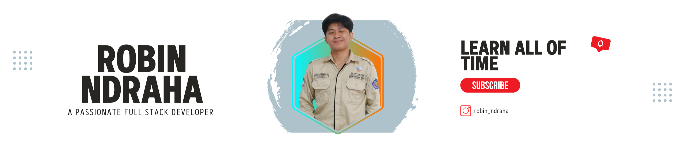

I'm currently Information Technology student at Universitas Jenderal Achmad Yani Yogyakarta with a focus on software development and cybersecurity. Possesses an understanding of various programming languages, frameworks, and cybersecurity principles. Actively seeking opportunities to develop skills and knowledge in this field.

## 🌐 Socials:
  

# 💻 Tech Stack:

### ✍️ Dev Quote

---

<!-- Proudly created with GPRM ( https://gprm.itsvg.in ) -->
<picture>
  <source media="(prefers-color-scheme: dark)" srcset="https://raw.githubusercontent.com/Rndraha21/Rndraha21/output/github-snake-dark.svg" />
  <source media="(prefers-color-scheme: light)" srcset="https://raw.githubusercontent.com/Rndraha21/Rndraha21/output/github-snake.svg" />
  
</picture>

